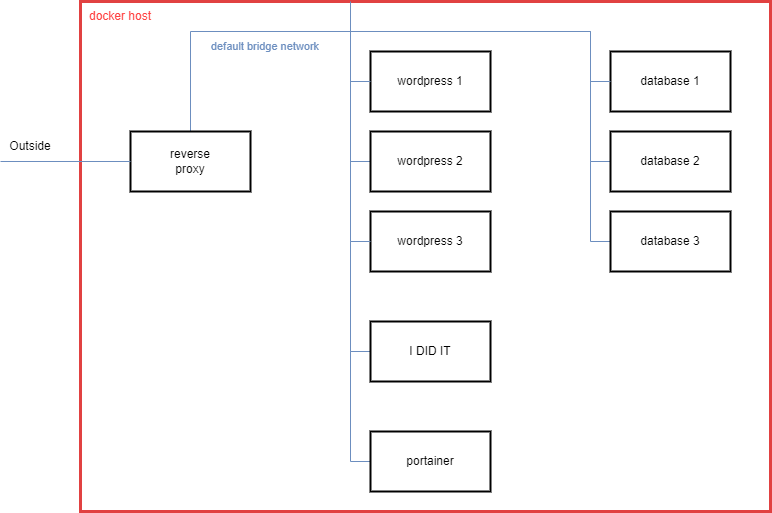

# layout


# links
| container             | link                  |
|-----------------------|-----------------------|
| portainer             | http://localhost:9000 |
| I DID IT              | http://localhost:8080 |
| reversee proxy        | http://localhost      |
| wordpress 1           | http://localhost:8081 |
| wordpress 2           | http://localhost:8082 |
| wordpress 3           | http://localhost:8083 |

# needed
* htpasswd package

# useage
supply env files
* host_ip (ip for ansibe host)
* host_user (user for ansible host)
* host_passwd (ssh password for ansible host)
* userpassword (sha512 hashed password)
```
htpasswd --method=sha512 <password> > userpassword
```

project directory is created under the home of the newly created user
`/home/dokwerker/stagingarea`

**tags**
* user:      creates user
* hostname:  changes hostname
* install:   installs docker
* prep:      prepares container files
* deploy:    deploys containers