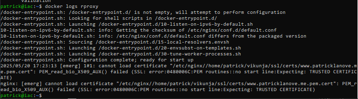
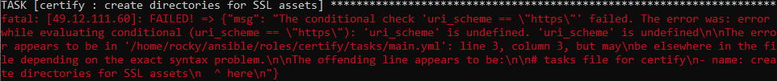

# bugs
## BUG template
**name** 

**context** 

**description** 

## BUG20250520-1
**name** 
cannot load certificate - no start line

**context** 
nginx container

**description** 
 
nginx cannot load the Let's Encrypt certificate

## BUG20250520-2
**name** 
extra dirs created

**context** 
file creation

**description** 
the directories `db` and `files` are also created at the user home directory

## BUG20250616-1
**name** 
playbook execution fails when variable is undefined

**context** 
playbook invocation

**description** 

The role *certify* fails to run when the variable *url_scheme* is not defined.
This variable is used to decide whether or not the role should run.

# open bugs
* BUG20250520-2
* BUG20250616-1

# closed bugs
* BUG20250520-1