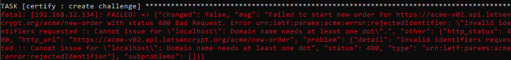
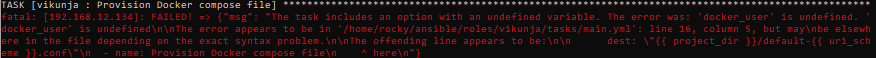

# open bugs
## BUG template
**title** 

**context** 

**description** 

**resolution** 

## BUG20250520-2
**title** 
extra dirs created

**context** 
file creation

**description** 
the directories `db` and `files` are also created at the user home directory

## BUG20250616-1
**title** 
playbook execution fails when variable is undefined

**context** 
playbook invocation

**description** 

The role *certify* fails to run when the variable *url_scheme* is not defined.
This variable is used to decide whether or not the role should run.

## BUG20250616-2
**title** 
host rebooted even when it's not needed

**context** 
role execution - dockerinstall

**description** 
The *dockerinstall* role contains a step that reboots the host.
If docker is already installed, there is no need to reboot the host.
Unnecessary reboots need to be avoided as much as possible.

**resolution** 
One solution for this is to run the role conditionally.
The condition should check whether the docker-ce package is installed on the host.

## BUG20250617-1
**title** 
Cannot issue cert for localhost

**context** 
Let's Encrypt certificate request

**description** 

Let's Encrypt does not allow the use of *localhost* as Common Name.

So calling the playbook with *cn=localhost* summons the above error

# closed bugs
## BUG20250520-1
**title** 
cannot load certificate - no start line

**context** 
nginx container

**description** 
 
nginx cannot load the Let's Encrypt certificate

## BUG20250617-2
**title** 
undefined variable *docker_user* for vikunja role

**context** 
variable scope outside the role

**description** 

The vikunja role uses a variable *docker_user*
The variable is expected to be inherited through the playbook, from a previous role *dockerinstall*
The role *dockerinstall* does not set the variable *docker_user* explicitly. It is passed from the playbook.

**resolution** 
Pass the variable explicitly when calling the role in the playbook.
